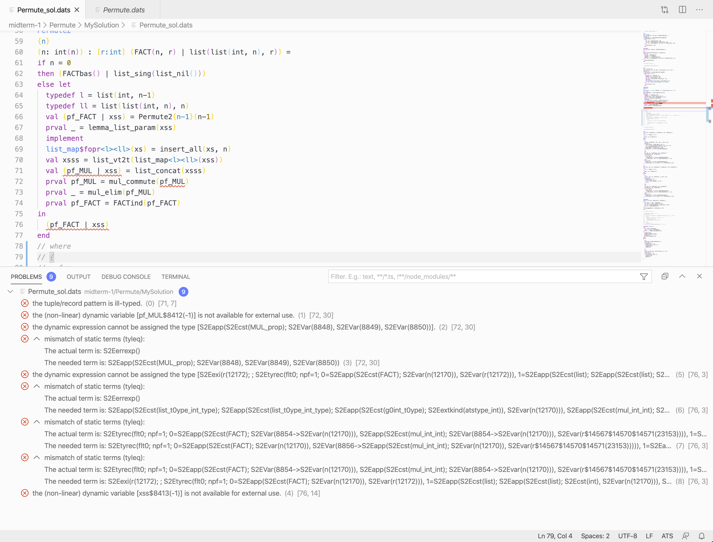

# Diagnostics for ATS type checking. 

Inspired by ats-mode for emacs, this extension brings ATS error diagnostics to
VScode. The hope is to lower the barrier to entry for ATS programming as emacs
can be difficult to learn. Sparverius's ATS-Temptory syntax highlighting is also
superior to what ats-mode has in my opinion.

## Requirements 

Make sure that command `patscc` and other ATS dependencies is in the PATH.
Please refer to <http://www.ats-lang.org/> for detailed instruction on
installing ATS.

## Screenshot

## Known Issues

This extension has only been tested on macOS, it may not work on Linux or
Windows. It is possible that the need for POSIX emulation to run ATS on Windows
breaks VScode's path system.